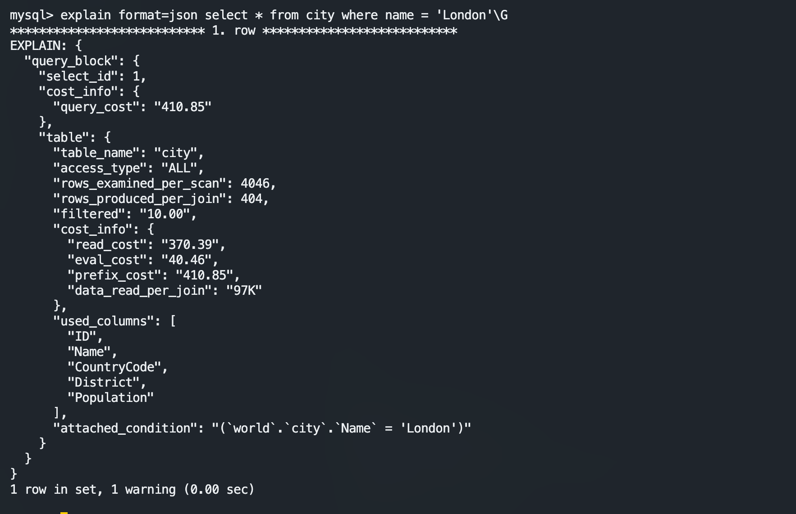

# 2. Analyzing Queries 
Explain Analyze Key Concept
- Reveal where time is spent and why?
- Display the difference between planning vs actual execution 

Ex.1 Single table, table scan 
```sql
explain format=json select * from city where name = 'London'\G
```


```sql
explain format=tree select * from city where name = 'London'\G
```


```sql
explain analyze select * from city where name = 'London'\G
```


Ex. 2 Single Table, Index access.
```sql 
explain analyze select * from city where countrycode='FRA'
```

EX 3. Multicolumn index
```sql
explain analyze select * from countrylanguage where countrycode='CHN'
```


EX 4. Two tables with subquery and sorting 

```sql
USE WORLD; 
EXPLAIN SELECT * FROM city WHERE name = 'London' \G
EXPLAIN ANALYZE SELECT * FROM city WHERE name = 'London' \G
EXPLAIN FORMAT=JSON SELECT * FROM city WHERE name = 'London' \G

EXPLAIN ANALYZE
        SELECT *
          FROM world.city
         WHERE CountryCode = 'FRA'\G
        
SHOW COLUMNS FROM countrylanguage;
EXPLAIN ANALYZE
        SELECT *
          FROM world.countrylanguage
         WHERE CountryCode = 'CHN'\G;
         
EXPLAIN ANALYZE
       SELECT ci.ID, ci.Name, ci.District,
              co.Name AS Country, ci.Population
         FROM world.city ci
              INNER JOIN
                (SELECT Code, Name
                   FROM world.country
                  WHERE Continent = 'Europe'
                  ORDER BY SurfaceArea
                  LIMIT 10
                ) co ON co.Code = ci.CountryCode
        ORDER BY ci.Population DESC
        LIMIT 5\G;
        


USE test; 
# CREATE DATABASE test;
CREATE TABLE test_estimates (
    id INT AUTO_INCREMENT PRIMARY KEY, val INT, val2 INT);
ALTER TABLE test_estimates ADD INDEX idx(val);
```
Before adding functional index it was scan the full table 
```sql
explain analyze select * from test_estimates where 2 * val < 3;
```


After adding a functional index, now not scanning the full table

```sql
alter table test_estimates add index idx_fun((2*val));
```


