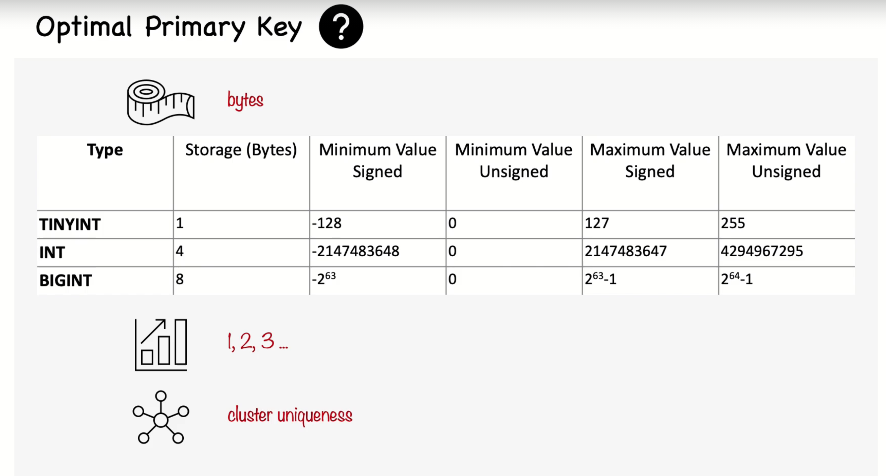

# 4. The Clustered index and choosing the primary key

# 1. What is a Clustered Index?
- Clustered index determines the physical order of rows in the table.
- In InnoDB, the primary key becomes the clustered index by default.
- A table can have only one clustered index.
- It optimizes range queries but can slow down inserts and updates if data is inserted out of order.

## Key Characteristics of Clustered indexes in MySQL:
- Only one clustered index per table: since the data can only be sorted in one way, a table can have only one clustered index.
- Primary key as clustered index: In innodb, if you create a primary key, MySQL automatically makes it the clustered index.
- Implicit Row order: If there is no primary key or unique key, InnoDB will use an internal hidden column (with a 6-byte unique identifier) as the clustered index. 

## Benefits of a Clustered Index:
- Faster Range Queries: Since data is physically stored in the same order as the index, queries that access ranges (rg. BETWEEN or ORDER BY) are very efficient.
- Primary Key Lookups are Faster: Since the primary key is the clustered index, looking up rows by the primary key is quick. 

## Downsides of a Clustered Index:
- Slower Insert and Update Operations: If you insert data out of order (eg. inserting rows randomly by the primary key), MySQL may need reorganize data on disk to maintain the clustered order.
- Secondary Indexes are larager: Secondary indexes in InnoDB must contain the primary key value, making them larger. 


# Choosing a Good Primary Key
Eg 1. Inserting rows in primary key order

Intserting rows in primary key order with InnoDB

Create two tables `user_info` & `userinfo_uuid`
```sql
CREATE TABLE userinfo (
   id              int unsigned NOT NULL AUTO_INCREMENT,
   name            varchar(64) NOT NULL DEFAULT '',
   email           varchar(64) NOT NULL DEFAULT '',
   password        varchar(64) NOT NULL DEFAULT '',
   dob             date DEFAULT NULL,
   address         varchar(255) NOT NULL DEFAULT '',
   city            varchar(64) NOT NULL DEFAULT '',
   state_id        tinyint unsigned NOT NULL DEFAULT '0',
   zip             varchar(8) NOT NULL DEFAULT '',
   country_id      smallint unsigned NOT NULL DEFAULT '0',
   account_type    varchar(32) NOT NULL DEFAULT '',
   closest_airport varchar(3) NOT NULL DEFAULT '',
   PRIMARY KEY (id),
   UNIQUE  KEY email (email),
   KEY     country_id (country_id),
   KEY     state_id (state_id),
   KEY     state_id_2 (state_id,city,address)
) ENGINE=InnoDB;

CREATE TABLE userinfo_uuid (
   uuid            varchar(36) NOT NULL,
   name            varchar(64) NOT NULL DEFAULT '',
   email           varchar(64) NOT NULL DEFAULT '',
   password        varchar(64) NOT NULL DEFAULT '',
   dob             date DEFAULT NULL,
   address         varchar(255) NOT NULL DEFAULT '',
   city            varchar(64) NOT NULL DEFAULT '',
   state_id        tinyint unsigned NOT NULL DEFAULT '0',
   zip             varchar(8) NOT NULL DEFAULT '',
   country_id      smallint unsigned NOT NULL DEFAULT '0',
   account_type    varchar(32) NOT NULL DEFAULT '',
   closest_airport varchar(3) NOT NULL DEFAULT '',
   PRIMARY KEY (uuid),
   UNIQUE  KEY email (email),
   KEY     country_id (country_id),
   KEY     state_id (state_id),
   KEY     state_id_2 (state_id,city,address)
) ENGINE=InnoDB;

# Command to check the index sizes
SELECT
  TABLE_NAME AS `Table`,
  ROUND((DATA_LENGTH + INDEX_LENGTH) / 1024 / 1024) AS `Size (MB)`
FROM
  information_schema.TABLES
WHERE
  TABLE_SCHEMA = "test"
ORDER BY
  (DATA_LENGTH + INDEX_LENGTH)
DESC;
```

Bash script for inserting dummy rows
```bash

# Insert required number of rows and measured the time for execution
# Insert into userinfo
#!/bin/bash

# Start the SQL file with the initial INSERT statement
echo "INSERT INTO userinfo (name, email, password, dob, address, city, state_id, zip, country_id, account_type, closest_airport) VALUES" > insert_users.sql

# Loop to generate 1,000,000 rows
for i in $(seq 1 1000000); do
    # Append each row to the SQL file
    echo "(\"John Smith\", \"john.smith+$i@email.com\", \"1234\", \"1986-02-14\", \"1795 Santiago de Compostela Way\", \"Austin\", 1, \"18743\", 1, \"customer account\", \"aut\")," >> insert_users.sql
done

# Replace the last comma with a semicolon to finalize the SQL query
sed -i '$ s/,$/;/' insert_users.sql

echo "SQL file 'insert_users.sql' created successfully."


# Insert required number of rows and measured the time for execution
# Insert into userinfo_uuid
#!/bin/bash

# Start the SQL file with the initial INSERT statement
echo "INSERT INTO userinfo_uuid (uuid, name, email, password, dob, address, city, state_id, zip, country_id, account_type, closest_airport) VALUES" > insert_userinfo_uuid.sql

# Start timer
START_TIME=$(date +%s)

# Loop to generate 1,000,000 rows
for i in $(seq 1 1000000); do
    # Generate a new UUID using /proc/sys
    UUID=$(cat /proc/sys/kernel/random/uuid)

    # Append the SQL row to the file
    echo "(\"$UUID\", \"John Smith\", \"john.smith+$i@email.com\", \"1234\", \"1986-02-14\", \"1795 Santiago de Compostela Way\", \"Austin\", 1, \"18743\", 1, \"customer account\", \"aut\")," >> insert_userinfo_uuid.sql

    # Print progress every 100,000 rows
    if (( i % 100000 == 0 )); then
        echo "$i rows generated..."
    fi
done

# Replace the last comma with a semicolon to finalize the SQL query
sed -i '$ s/,$/;/' insert_userinfo_uuid.sql

# End timer
END_TIME=$(date +%s)

# Print the total execution time
echo "SQL file 'insert_userinfo_uuid.sql' created successfully."
echo "Execution Time: $((END_TIME - START_TIME)) seconds"
```

Optimal Primary Key in practice

