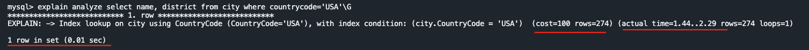
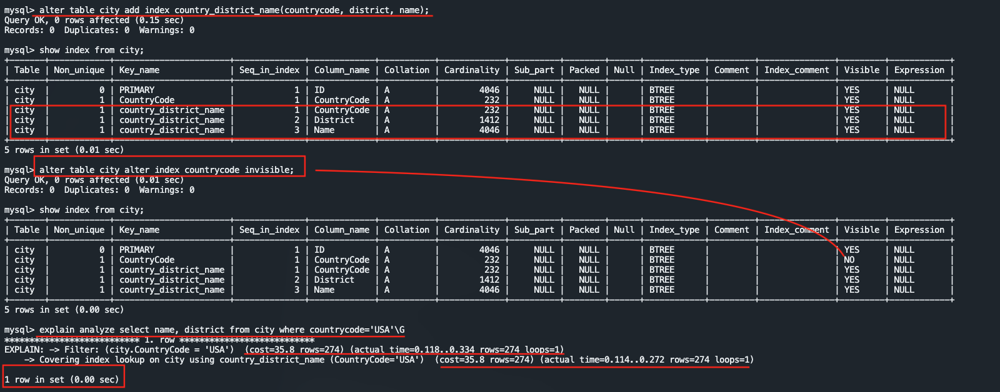

# 5. Indexing for Performance
In the payment table before adding index ordering takes time, also full table scan was required 
```sql
explain analyze select * from payment order by amount desc limit 10;
```

After adding index it scan from the idx_amt index and reduce the execution time.
```sql
alter table payment add index idx_amt(amount)
```


```sql
USE SAKILA;
EXPLAIN ANALYZE SELECT * FROM payment WHERE amount = '10.99';
EXPLAIN ANALYZE SELECT * FROM payment ORDER BY amount DESC LIMIT 10;
ALTER TABLE payment ADD INDEX IDX_AMT(amount);
SELECT customer_id, MAX(amount) FROM payment GROUP BY customer_id LIMIT 10;

# Find tables or statements that dont make use of an index 

USE sys;
SELECT * FROM SCHEMA_TABLES_WITH_FULL_TABLE_SCANS;
SELECT * FROM STATEMENTS_WITH_FULL_TABLE_SCANS;

# Find unused indexes
USE sys;
SELECT * FROM SCHEMA_INDEX_STATISTICS\G
SELECT * FROM SCHEMA_UNUSED_INDEXES\G
SELECT * FROM SCHEMA_REDUNDANT_INDEXES\G

# Display system-global variable innodb_stats_persistent_sample_pages
SHOW VARIABLES LIKE 'innodb_stats_persistent_sample_pages';
```
## When to add/remove an Index
- By checking `schema_unused_indexes`
```sql
select * from schema_unused_indexes\G
```
- By Checking Schema redundant index uses
```sql
select * from schema_redundant_indexes\G
```
## Covering Index
Before adding the covering index, the cost, number of scanned rows, and execution time were high.
```sql
explain analyze select name, district from city where countrycode='USA'\G
```

After adding the covering index the cost, number of scanned rows, and execution time were reduces. 
```sql 
alter table city add index country_district_name(countrycode, district, name);
```


