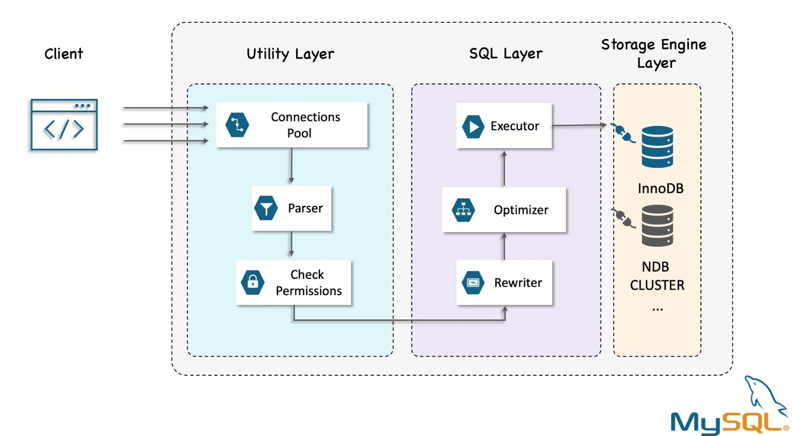
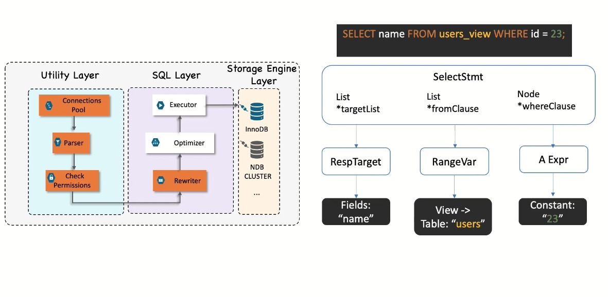
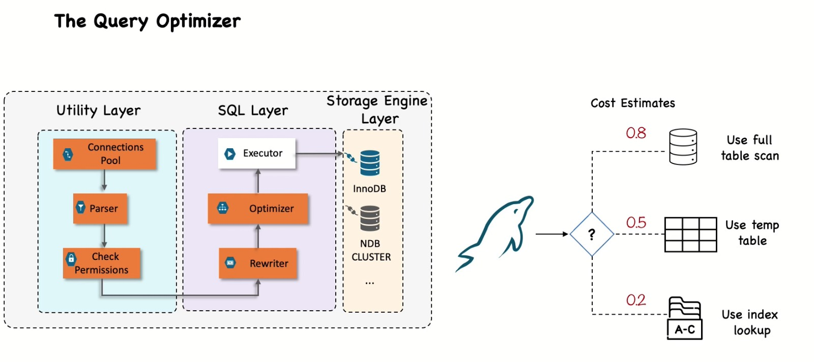
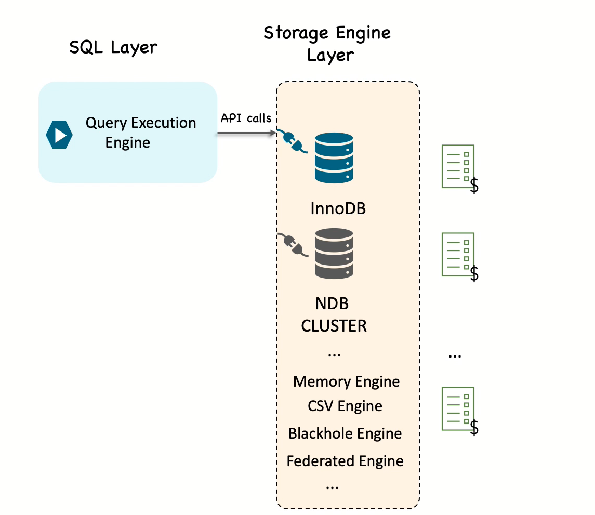

# 1. Query Execution Basic
1. User send a query statement to server Utitility layer. 
2. Utility laryer make the connections, send parser, check the permission and generate a parse tree. 
3. SQL layer takes the query parse and execute, finally send to storage layer (Storage Engine Layer)
 
**Utility Layer:** The utility layer in MySQL, also known as the server layer, that supports Database management (e.g., backup, restoration, schema migration), Performance tuning (e.g., profiling queries, monitoring slow queries), Security and access control (e.g., managing users and permissions), Server administration (e.g., starting/stopping services, checking logs), Data synchronization (e.g., replication, clustering).

### Usually, MySQL uses dynamix optimizations, which are based on context. (which value is in a WHERE clause, the number of pages per table or the cadinality, that is , number of distinct values of the indexes, the length if the rows and keys and the key distribution etc.
**SQL Layer:** The SQL layer in MySQL is responsible for handling the SQL syntax and query processing. The SQL layer interprets and executes SQL commands such as SELECT, INSERT, UPDATE, and DELETE, as well as other database operations, before passing them to the appropriate storage engine for actual data management.  

### If it is known that the query optimizer isn't giving a good result, and you know why, you can help it. Some of the options are to add a hint to the query, rewrite the query, redesign schema or add indexes. 

**Storage Engine Layer:** MySQL default use InnoDB as a storage enginer. It supports ACID-compliant transactions (Atomicity, Consistency, Isolation, Durability) and foreign key constraints, making it suitable for applications that require reliable and consistent data handling. Responsible for storing and retrieving all data stored in mysql. 

