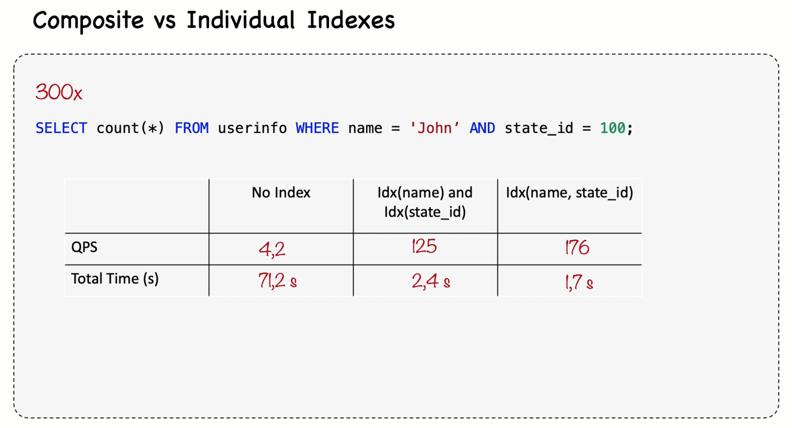

# MySQL Composite Index

A MySQL composite index is an index that includes multiple columns in a table. It is used to speed up queries that filter or sort data based on multiple columns. Composite indexes can significantly improve the performance of SELECT queries by allowing the database to quickly locate rows that match the specified criteria.

## Benefits of Composite Indexes
- **Improved Query Performance**: Speeds up queries that filter or sort by multiple columns.
- **Efficient Data Retrieval**: Reduces the number of rows scanned by the database engine.
- **Optimized Storage**: Can be more efficient than multiple single-column indexes.

## Example
Consider a table `employees` with columns `first_name`, `last_name`, and `department_id`. A composite index on `(last_name, department_id)` can improve the performance of queries like:

```sql
SELECT * FROM employees
WHERE last_name = 'Smith' AND department_id = 5;
```

## Creating a Composite Index
To create a composite index, use the following SQL syntax:

```sql
CREATE INDEX idx_lastname_deptid ON employees (last_name, department_id);
```

## Usage Tips
- Order matters: Place the most selective columns first.
- Use composite indexes for queries that filter or sort by multiple columns.
- Avoid creating unnecessary composite indexes to save storage and maintenance overhead.

## Composite vs Individual Indexes


## Redundant Indexes 

