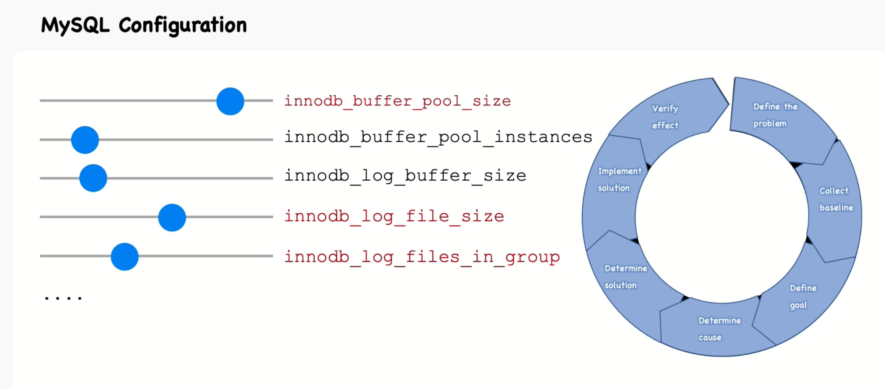

# MySQL Configuration Best Practices

## Important Configuration for Buffer Pool

The buffer pool is a critical component for MySQL performance. Here are some important settings:

### `innodb_buffer_pool_size`
- **Description**: Determines the size of the buffer pool, which caches data and indexes.
- **Recommendation**: Set to 70-80% of available memory on a dedicated database server.

### `innodb_buffer_pool_instances`
- **Description**: Divides the buffer pool into multiple instances to reduce contention.
- **Recommendation**: Use multiple instances if `innodb_buffer_pool_size` is greater than 1GB. Typically, 8 instances are a good starting point.

### `innodb_buffer_pool_chunk_size`
- **Description**: Defines the size of chunks within the buffer pool.
- **Recommendation**: Adjust based on workload and buffer pool size. Default is usually sufficient.

### Example Configuration
```ini
[mysqld]
innodb_buffer_pool_size = 8G
innodb_buffer_pool_instances = 8
innodb_buffer_pool_chunk_size = 128M
```
### Troubleshooting Slow Queries After Server Restart

If you encounter slow queries after a server restart, consider tuning the following parameter:

### `innodb_flush_log_at_trx_commit`
- **Description**: Controls the balance between performance and durability. Setting this to 1 provides the highest durability by flushing the log to disk after every transaction.
- **Recommendation**: For better performance, you can set this to 2, which flushes the log to disk once per second. However, this may result in some data loss in the event of a crash.

### Example Configuration
```ini
[mysqld]
innodb_flush_log_at_trx_commit = 2
```

### Tuning Flushing Pages Process

Flushing pages from the buffer pool to disk is crucial for maintaining data integrity and performance. Here are some important settings to consider:

### `innodb_flush_method`
- **Description**: Defines the method used to flush data to disk.
- **Recommendation**: `O_DIRECT` is often recommended for Linux systems to avoid double buffering. For Windows, `async_unbuffered` is a good choice.

### `innodb_flush_neighbors`
- **Description**: Controls whether InnoDB tries to flush neighboring pages from the same extent.
- **Recommendation**: Set to 0 for SSDs to avoid unnecessary writes. For HDDs, the default value of 1 can help with sequential writes.

### `innodb_io_capacity`
- **Description**: Limits the number of I/O operations per second.
- **Recommendation**: Set based on your storage system's capabilities. For SSDs, a higher value like 2000 or more is appropriate. For HDDs, a lower value like 200 is typical.

### Example Configuration
```ini
[mysqld]
innodb_flush_method = O_DIRECT
innodb_flush_neighbors = 0
innodb_io_capacity = 2000
```

### Tuning Redo Log Buffer

The redo log buffer is essential for ensuring data durability and crash recovery. Here are some important settings:

### `innodb_log_buffer_size`
- **Description**: Determines the size of the buffer that holds changes to the database before they are written to the redo log files.
- **Recommendation**: A larger buffer can improve performance for transactions that generate large amounts of redo log data. Typically, 16M to 128M is a good range.

### Example Configuration
```ini
[mysqld]
innodb_log_buffer_size = 64M
```

### Redo logs related configurations 
```sql
SHOW GLOBAL variables like 'innodb_log_buffer_size';
SHOW GLOBAL variables like 'innodb_log_file_size';
SHOW GLOBAL variables like 'innodb_log_files_in_group';
```



