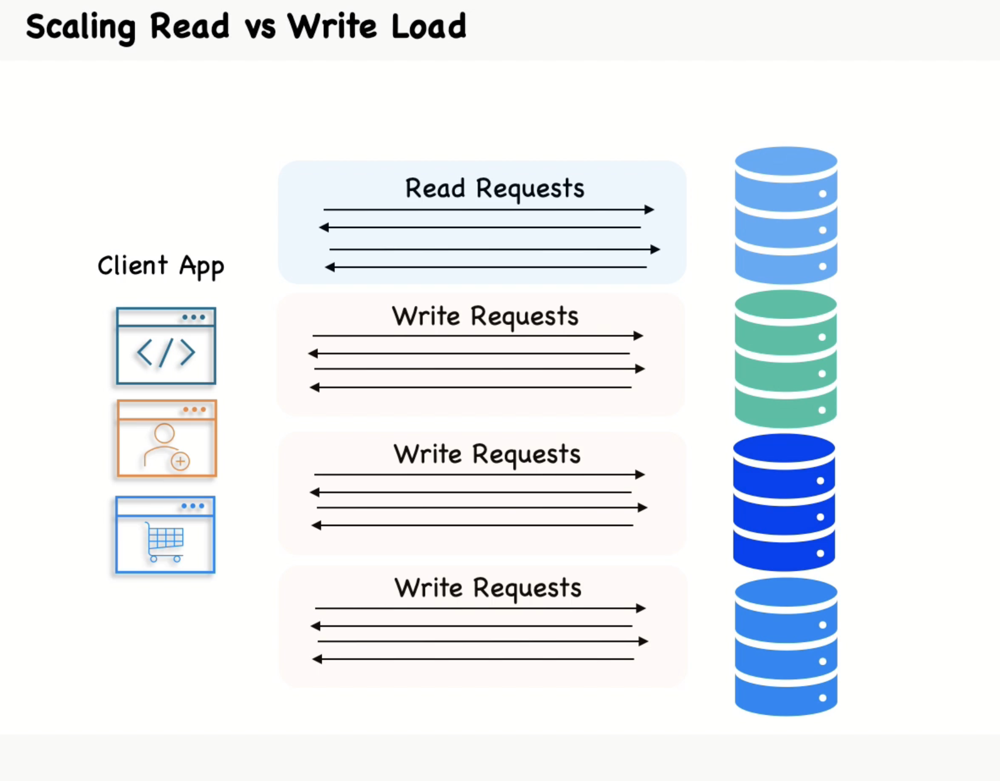

# MySQL Scaling: Read vs Write Load

When scaling MySQL, it's important to understand the differences between read and write loads and how to handle them effectively.

## Read Load

Read load refers to the number of read operations (SELECT queries) your database handles. To scale read load, consider the following strategies:

- **Read Replicas**: Use read replicas to distribute read traffic across multiple database instances.
- **Caching**: Implement caching mechanisms like Memcached or Redis to reduce the number of direct database reads.
- **Indexing**: Ensure proper indexing to speed up read queries.

## Write Load

Write load refers to the number of write operations (INSERT, UPDATE, DELETE queries) your database handles. To scale write load, consider the following strategies:

- **Sharding**: Distribute data across multiple database instances to balance the write load.
- **Queueing**: Use message queues to handle high write loads asynchronously.
- **Optimized Queries**: Optimize write queries to reduce the load on the database.

## Balancing Read and Write Load

Balancing read and write load is crucial for maintaining database performance. Here are some tips:

- **Load Balancers**: Use load balancers to distribute traffic efficiently.
- **Monitoring**: Continuously monitor database performance and adjust strategies as needed.
- **Database Configuration**: Tune database configurations to handle the specific read/write patterns of your application.

## Replication - Scaling Reads with Read Pools

Replication is a powerful technique for scaling read operations in MySQL. By creating multiple copies of your database, you can distribute read traffic and improve performance. Here are some key points to consider:

- **Master-Slave Replication**: Set up a master database to handle write operations and one or more slave databases to handle read operations. This separation allows you to scale reads independently of writes.
- **Read Pools**: Group multiple read replicas into a read pool. Use a load balancer to distribute read queries across the pool, ensuring even load distribution and high availability.
- **Consistency**: Be aware of replication lag, which can cause read replicas to be slightly out of sync with the master. Implement strategies to handle eventual consistency in your application.
- **Failover**: Plan for failover scenarios where a read replica or the master fails. Ensure that your system can promote a read replica to master if needed.

By leveraging replication and read pools, you can significantly enhance the read performance of your MySQL database, ensuring it can handle high traffic loads efficiently.

## Replication - Service Discovery for Read Pools

Service discovery is essential for managing and scaling read pools in a dynamic environment. It helps in automatically detecting and connecting to available read replicas. Here are some strategies for implementing service discovery:

- **DNS-Based Discovery**: Use DNS to manage and resolve the addresses of read replicas. This approach is simple and integrates well with existing infrastructure.
- **Service Registry**: Implement a service registry (e.g., Consul, etcd, or Zookeeper) to keep track of available read replicas. The registry can provide health checks and automatically update the list of active replicas.
- **Load Balancers with Health Checks**: Configure load balancers to perform health checks on read replicas. This ensures that only healthy replicas receive traffic, improving reliability and performance.
- **Dynamic Configuration**: Use configuration management tools to dynamically update application configurations with the addresses of available read replicas. This allows your application to adapt to changes in the read pool without downtime.

## Sharding Concerns

Sharding can significantly improve the scalability of your MySQL database, but it also introduces several challenges that need to be addressed:

- **Data Distribution**: Ensure that data is evenly distributed across shards to prevent hotspots. Use consistent hashing or range-based sharding strategies.
- **Cross-Shard Joins**: Avoid or minimize cross-shard joins, as they can be complex and slow. Design your schema to reduce the need for such operations.
- **Rebalancing Shards**: Plan for rebalancing shards as your data grows. Implement automated tools and processes to redistribute data without downtime.
- **Global Transactions**: Handling transactions that span multiple shards can be challenging. Use distributed transaction protocols like two-phase commit (2PC) or design your application to handle eventual consistency.
- **Backup and Recovery**: Develop a robust backup and recovery strategy for sharded databases. Ensure that you can restore individual shards and maintain data consistency across shards.
- **Monitoring and Maintenance**: Continuously monitor the performance of each shard and perform regular maintenance. Use monitoring tools to detect and address issues proactively.

