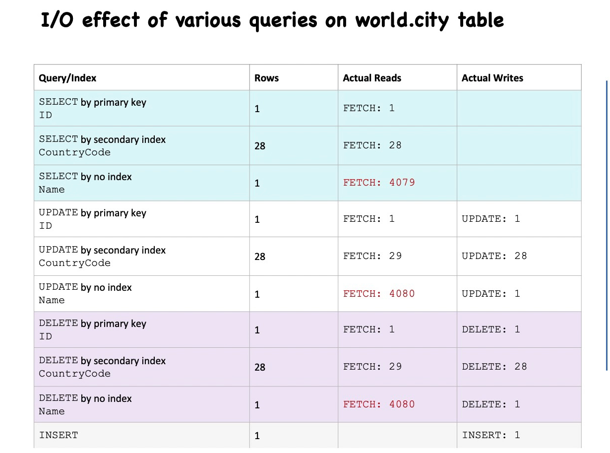

# 2. Spotting Query Problems 
The table `performance_schema.events_statements_summary_by_digest` can get following queries
- Which queries are executed the most?
- Which queries take the longest to execute?
- Which queries consume the most resources?
- Are there any expensive or inefficient queries that need optimization?

The following SQL commands returns Large output, more readable, analyzing long queries stored in the DIGEST_TEXT column, easier to focus on specific fields for performance tuning.  
```sql 
select * from events_statements_summary_by_digest\G
```
The following sql commands will return first 10 time consuming executed query 
```sql
select * from events_statements_summary_by_digest order by sum_timer_wait desc limit 10\G
```

```sql
SELECT (100 * SUM_TIMER_WAIT / sum(SUM_TIMER_WAIT)
            OVER ()) percent,
            SUM_TIMER_WAIT AS total,
            COUNT_STAR AS calls,
            AVG_TIMER_WAIT AS mean,
            substring(DIGEST_TEXT, 1, 75)
  FROM  performance_schema.events_statements_summary_by_digest
            ORDER BY SUM_TIMER_WAIT DESC
            LIMIT 10;
```

```sql
SELECT * FROM   sys.statement_analysis LIMIT 10\G
```
The following sql will reveal the estimate usefulness of the indexes and whether table scans are executed for the table. 
```sql
SELECT OBJECT_TYPE, OBJECT_SCHEMA, OBJECT_NAME,INDEX_NAME, COUNT_STAR FROM performance_schematable_io_waits_summary_by_index_usage WHERE OBJECT_SCHEMA = 'world' AND OBJECT_NAME = 'city'\G
```
## Table I/O and File I/O for Updates and Delete
```sql
USE world;
describe city; 

SELECT *
FROM   city
WHERE  id = 5; 

SELECT *
FROM   city
WHERE  countrycode = 'nld';

SELECT *
FROM   city
WHERE  NAME = 'amsterdam';

SELECT *
FROM   performance_schema.table_io_waits_summary_by_table
WHERE  object_name = 'city' \G

UPDATE city
SET    NAME = 'Amsterdam1'
WHERE  NAME = 'Amsterdam'; 
```


By the following SQL command can see the error logs
```sql
SELECT * FROM   performance_schema.events_errors_summary_by_account_by_error WHERE  error_name = 'ER_LOCK_DEADLOCK' \G
```